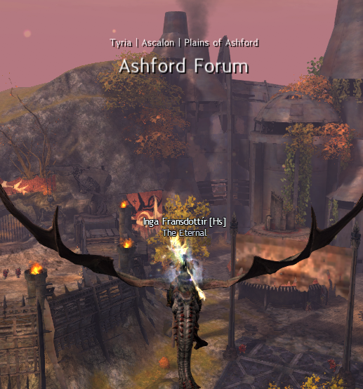

# GW2Nexus-RegionsOfTyria
Addon for GW2 Nexus to display the current zone information whenever crossing borders - just like your favorite (MMO)RPG does!

This addons started out as learning project and turned into an inofficial port of one of my favorite BlishHUD modules: 
https://github.com/agaertner/bhm-zone-display

### Features
- Popup text that displays the zone you just entered. Currently works for PvE maps only.
- Language support for en, de, es and fr - change the settings in the Nexus quick settings menu

### Planned features
- Custom fonts based on the race you are playing
- Support for your custom fonts by replacing the original file
- Effects for the animation
- Mini Widgets with condensed information you can attach to your minimap, compass or anywhere else
- Extended zone information widget (which POIs, events etc. are within this zone)
- Live loading from the GW2 API (see known issues)

### Known issues
- Map information is not updated automatically but read from a precompiled JSON
  - The underlying issue is with OpenSSL not unloading properly on addon unload, making addon updates unfeasible
- Addon unloading takes some seconds when unload is being called during initialization of the addon or in the middle of an animation

