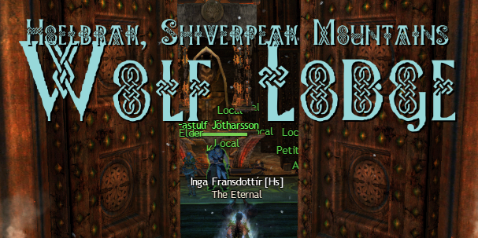
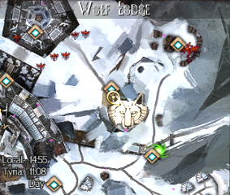
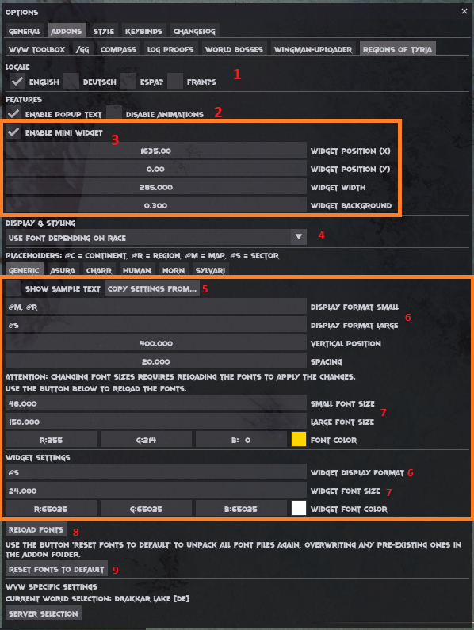

# GW2Nexus-RegionsOfTyria
Addon for GW2 Nexus to display the current zone information whenever crossing borders - just like your favorite (MMO)RPG does!

This addons started out as learning project and turned into an inofficial port of one of my favorite BlishHUD modules: 
https://github.com/agaertner/bhm-zone-display

 

### Features
- Popup text that displays the zone you just entered
  - Including animations whenever the popup fades in/out
- Mini Widget that is active during gameplay
- Custom fonts that change with the race of your character as well as a generic font
  - Support for your own fonts
- Fully customizable display options regarding formats, colors and sizes
- Language support for en, de, es and fr - change the settings in the Nexus quick settings menu
- Map updates via GW2 API

### Customizing your experience
Regions of Tyria allows for a high level of customization. To get the most out of it by tailoring it to your wants and needs, there's a bunch of options available:

1. Option to change the language of output - This will affect names of Maps, Sectors etc.
2. Toggles for the main popup text - You can either disable the entire text, or just the animation during fades
3. This block handles how the mini widget is displayed; more options are available in the specific sections block
4. This dropdown allows you to change the mode of display - you can pick whether you want to use fonts specific to races, a generic font or even a font of a race for everything
5. This entire block handles display formatting **per font**. Each tab available has its own values. If you really like the setup you created for one race you can copy that setting to others using this button
6. This allows you to alter how texts are displayed, using placeholders. The explanation for placeholders can be found in the options screen as well
7. You can alter font sizes on demand. Note that if you change font sizes you need to reload them to take effect
8. This button reloads all fonts specific to the addon. Other ways to reload fonts include unloading and reloading the addon, and restarting the game. This button is the least extreme option. Note that the UI might flicker for a bit until everything is back in order.
9. This button resets all fonts to the current font version default. It will unpack all fonts from the addon library. Unlike addon initialization, this will also overwrite existing ones. Note that fonts will get reloaded in the process, doing essentially the same as the button labeled 8 in the process.

You think my font selections are bad and you want to change things up for your own likings? You can absolutely do that!
In your `<GW2InstallDir>/addons/TyrianRegions` folder there's a bunch of TTF files. These are the fonts being used to display about everything in the addon.
All font files follow a certain pattern:
- fonts for actual readable text are named font_<scenario>.ttf
- fonts used for the animation during fade are named fonts_<scenario>_anim.ttf

Say you want to replace both the animation font and readable font for humans. In that case all you need to do is replace the font_human.ttf and fonts_human_anim.ttf and you're done!
Remember to reload fonts using the button in the options.

Every now and then I might change the default font for something, raising the internal font version. In that case you will see a popup text giving you the choice of either loading the new versions or keeping things as is.
Mind that loading the new versions will replace **all** files. If you have custom fonts in place, make sure to back them up first!

### Planned features and ideas
- Extended zone information widget (which POIs, events etc. are within this zone)
- Option to color capitalized letters in different colors

### Known issues
- Addon unloading takes some seconds when unload is being called during initialization of the addon or in the middle of an animation
- World vs. World team names aren't updated yet
  - This is due to the GW2 API not offering the new names yet

### You have any suggestions? Let me know!
I am active on the Raidcore.gg discord, and Regions of Tyria has its own channel: https://discord.com/channels/410828272679518241/1243221036175069284

I'd love to hear suggestions, or just see showcases of what you did with this addon!